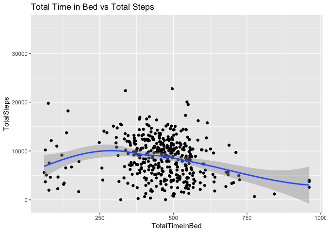

Bellabeat_Google_Data_Analytics_2
================
Shelby Hagstrom
5/10/2022

## Setting up my environment

``` r
## install the tidyverse package
install.packages("tidyverse", repos = "http://cran.us.r-project.org")
```

    ## 
    ##   There is a binary version available but the source version is later:
    ##           binary source needs_compilation
    ## tidyverse  1.3.0  1.3.1             FALSE

    ## installing the source package 'tidyverse'

``` r
## load packages
library(tidyverse)
```

    ## ── Attaching packages ─────────────────────────────────────── tidyverse 1.3.1 ──

    ## ✓ ggplot2 3.3.5     ✓ purrr   0.3.4
    ## ✓ tibble  3.1.6     ✓ dplyr   1.0.7
    ## ✓ tidyr   1.1.4     ✓ stringr 1.4.0
    ## ✓ readr   2.1.2     ✓ forcats 0.5.1

    ## Warning: package 'stringr' was built under R version 3.5.2

    ## ── Conflicts ────────────────────────────────────────── tidyverse_conflicts() ──
    ## x dplyr::filter() masks stats::filter()
    ## x dplyr::lag()    masks stats::lag()

``` r
library(lubridate)
```

    ## 
    ## Attaching package: 'lubridate'

    ## The following objects are masked from 'package:base':
    ## 
    ##     date, intersect, setdiff, union

``` r
library(rmarkdown)
library(knitr)
library(reader)
```

    ## Loading required package: NCmisc

    ## 
    ## Attaching package: 'reader'

    ## The following objects are masked from 'package:NCmisc':
    ## 
    ##     cat.path, get.ext, rmv.ext

##Collect the data

``` r
## upload csv files
daily_activity <- read.csv("Fitabase Data 4.12.16-5.12.16/dailyActivity_merged.csv")
sleep_day <- read.csv("Fitabase Data 4.12.16-5.12.16/sleepDay_merged.csv")
```

## Explore the data frames and add columns for analysis

daily_activity data frame

``` r
#inspect the daily_activity data frame
colnames(daily_activity)  #List of column names
```

    ##  [1] "Id"                       "ActivityDate"            
    ##  [3] "TotalSteps"               "TotalDistance"           
    ##  [5] "TrackerDistance"          "LoggedActivitiesDistance"
    ##  [7] "VeryActiveDistance"       "ModeratelyActiveDistance"
    ##  [9] "LightActiveDistance"      "SedentaryActiveDistance" 
    ## [11] "VeryActiveMinutes"        "FairlyActiveMinutes"     
    ## [13] "LightlyActiveMinutes"     "SedentaryMinutes"        
    ## [15] "Calories"

``` r
nrow(daily_activity)  #Number of rows in the data frame
```

    ## [1] 940

``` r
dim(daily_activity)  #Dimensions of the data frame
```

    ## [1] 940  15

``` r
head(daily_activity)  #See the first 6 rows of data frame.
```

    ##           Id ActivityDate TotalSteps TotalDistance TrackerDistance
    ## 1 1503960366    4/12/2016      13162          8.50            8.50
    ## 2 1503960366    4/13/2016      10735          6.97            6.97
    ## 3 1503960366    4/14/2016      10460          6.74            6.74
    ## 4 1503960366    4/15/2016       9762          6.28            6.28
    ## 5 1503960366    4/16/2016      12669          8.16            8.16
    ## 6 1503960366    4/17/2016       9705          6.48            6.48
    ##   LoggedActivitiesDistance VeryActiveDistance ModeratelyActiveDistance
    ## 1                        0               1.88                     0.55
    ## 2                        0               1.57                     0.69
    ## 3                        0               2.44                     0.40
    ## 4                        0               2.14                     1.26
    ## 5                        0               2.71                     0.41
    ## 6                        0               3.19                     0.78
    ##   LightActiveDistance SedentaryActiveDistance VeryActiveMinutes
    ## 1                6.06                       0                25
    ## 2                4.71                       0                21
    ## 3                3.91                       0                30
    ## 4                2.83                       0                29
    ## 5                5.04                       0                36
    ## 6                2.51                       0                38
    ##   FairlyActiveMinutes LightlyActiveMinutes SedentaryMinutes Calories
    ## 1                  13                  328              728     1985
    ## 2                  19                  217              776     1797
    ## 3                  11                  181             1218     1776
    ## 4                  34                  209              726     1745
    ## 5                  10                  221              773     1863
    ## 6                  20                  164              539     1728

``` r
str(daily_activity)  #See list of columns and data types (numeric, character, etc)
```

    ## 'data.frame':    940 obs. of  15 variables:
    ##  $ Id                      : num  1.5e+09 1.5e+09 1.5e+09 1.5e+09 1.5e+09 ...
    ##  $ ActivityDate            : Factor w/ 31 levels "4/12/2016","4/13/2016",..: 1 2 3 4 5 6 7 8 9 10 ...
    ##  $ TotalSteps              : int  13162 10735 10460 9762 12669 9705 13019 15506 10544 9819 ...
    ##  $ TotalDistance           : num  8.5 6.97 6.74 6.28 8.16 ...
    ##  $ TrackerDistance         : num  8.5 6.97 6.74 6.28 8.16 ...
    ##  $ LoggedActivitiesDistance: num  0 0 0 0 0 0 0 0 0 0 ...
    ##  $ VeryActiveDistance      : num  1.88 1.57 2.44 2.14 2.71 ...
    ##  $ ModeratelyActiveDistance: num  0.55 0.69 0.4 1.26 0.41 ...
    ##  $ LightActiveDistance     : num  6.06 4.71 3.91 2.83 5.04 ...
    ##  $ SedentaryActiveDistance : num  0 0 0 0 0 0 0 0 0 0 ...
    ##  $ VeryActiveMinutes       : int  25 21 30 29 36 38 42 50 28 19 ...
    ##  $ FairlyActiveMinutes     : int  13 19 11 34 10 20 16 31 12 8 ...
    ##  $ LightlyActiveMinutes    : int  328 217 181 209 221 164 233 264 205 211 ...
    ##  $ SedentaryMinutes        : int  728 776 1218 726 773 539 1149 775 818 838 ...
    ##  $ Calories                : int  1985 1797 1776 1745 1863 1728 1921 2035 1786 1775 ...

sleep_day data frame

``` r
#inspect the sleep_day data frame
colnames(sleep_day)  #List of column names
```

    ## [1] "Id"                 "SleepDay"           "TotalSleepRecords" 
    ## [4] "TotalMinutesAsleep" "TotalTimeInBed"

``` r
nrow(sleep_day)  #Number of rows in the data frame
```

    ## [1] 413

``` r
dim(sleep_day)  #Dimensions of the data frame
```

    ## [1] 413   5

``` r
head(sleep_day)  #See the first 6 rows of data frame.
```

    ##           Id              SleepDay TotalSleepRecords TotalMinutesAsleep
    ## 1 1503960366 4/12/2016 12:00:00 AM                 1                327
    ## 2 1503960366 4/13/2016 12:00:00 AM                 2                384
    ## 3 1503960366 4/15/2016 12:00:00 AM                 1                412
    ## 4 1503960366 4/16/2016 12:00:00 AM                 2                340
    ## 5 1503960366 4/17/2016 12:00:00 AM                 1                700
    ## 6 1503960366 4/19/2016 12:00:00 AM                 1                304
    ##   TotalTimeInBed
    ## 1            346
    ## 2            407
    ## 3            442
    ## 4            367
    ## 5            712
    ## 6            320

``` r
str(sleep_day)  #See list of columns and data types (numeric, character, etc)
```

    ## 'data.frame':    413 obs. of  5 variables:
    ##  $ Id                : num  1.5e+09 1.5e+09 1.5e+09 1.5e+09 1.5e+09 ...
    ##  $ SleepDay          : Factor w/ 31 levels "4/12/2016 12:00:00 AM",..: 1 2 4 5 6 8 9 10 12 13 ...
    ##  $ TotalSleepRecords : int  1 2 1 2 1 1 1 1 1 1 ...
    ##  $ TotalMinutesAsleep: int  327 384 412 340 700 304 360 325 361 430 ...
    ##  $ TotalTimeInBed    : int  346 407 442 367 712 320 377 364 384 449 ...

``` r
## add a TotalMinutes column to the daily_activity data frame
daily_activity <- daily_activity %>% 
  mutate(TotalMinutes = SedentaryMinutes + FairlyActiveMinutes + LightlyActiveMinutes + VeryActiveMinutes)
```

``` r
## Convert the ActivityDate into date format and add a column for day of the week
names(daily_activity)[names(daily_activity) == "ActivityDate"] <- "date" 

daily_activity <- daily_activity %>%
  mutate(date = mdy(date))

daily_activity$day_of_week <- format(as.Date(daily_activity$date), "%A")  ##Adds the day of week of the activity
```

``` r
## separate the  SleepDay column into a Date and Time column
sleep_day <- separate(sleep_day, SleepDay,into=c("SleepDate", "SleepTime"), sep= ' ')
```

    ## Warning: Expected 2 pieces. Additional pieces discarded in 413 rows [1, 2, 3, 4,
    ## 5, 6, 7, 8, 9, 10, 11, 12, 13, 14, 15, 16, 17, 18, 19, 20, ...].

``` r
## convert new SleepDate into date format and add a column for day of the week
names(sleep_day)[names(sleep_day) == "SleepDate"] <- "date" 

sleep_day <- sleep_day %>%
  mutate(date = mdy(date))

sleep_day$day_of_week <- format(as.Date(sleep_day$date), "%A")  ##Adds the day of week of the activity
```

``` r
 ## count the distinct number of participants per data frame}
n_distinct(daily_activity$Id)
```

    ## [1] 33

``` r
n_distinct(sleep_day$Id)
```

    ## [1] 24

``` r
## count how many rows per Id for each data frame
table(daily_activity['Id'])
```

    ## 
    ## 1503960366 1624580081 1644430081 1844505072 1927972279 2022484408 2026352035 
    ##         31         31         30         31         31         31         31 
    ## 2320127002 2347167796 2873212765 3372868164 3977333714 4020332650 4057192912 
    ##         31         18         31         20         30         31          4 
    ## 4319703577 4388161847 4445114986 4558609924 4702921684 5553957443 5577150313 
    ##         31         31         31         31         31         31         30 
    ## 6117666160 6290855005 6775888955 6962181067 7007744171 7086361926 8053475328 
    ##         28         29         26         31         26         31         31 
    ## 8253242879 8378563200 8583815059 8792009665 8877689391 
    ##         19         31         31         29         31

``` r
table(sleep_day['Id'])
```

    ## 
    ## 1503960366 1644430081 1844505072 1927972279 2026352035 2320127002 2347167796 
    ##         25          4          3          5         28          1         15 
    ## 3977333714 4020332650 4319703577 4388161847 4445114986 4558609924 4702921684 
    ##         28          8         26         24         28          5         28 
    ## 5553957443 5577150313 6117666160 6775888955 6962181067 7007744171 7086361926 
    ##         31         26         18          3         31          2         24 
    ## 8053475328 8378563200 8792009665 
    ##          3         32         15

``` r
## join the daily_activity and sleep_day data frames by Id, date, and day_of_week columns
merged_data <- left_join(daily_activity, sleep_day, by=c("Id","date", "day_of_week"))
```

``` r
## summary of the new merged_data data frame
merged_data %>%
  summary()
```

    ##        Id                 date              TotalSteps    TotalDistance   
    ##  Min.   :1.504e+09   Min.   :2016-04-12   Min.   :    0   Min.   : 0.000  
    ##  1st Qu.:2.320e+09   1st Qu.:2016-04-19   1st Qu.: 3795   1st Qu.: 2.620  
    ##  Median :4.445e+09   Median :2016-04-26   Median : 7439   Median : 5.260  
    ##  Mean   :4.858e+09   Mean   :2016-04-26   Mean   : 7652   Mean   : 5.503  
    ##  3rd Qu.:6.962e+09   3rd Qu.:2016-05-04   3rd Qu.:10734   3rd Qu.: 7.720  
    ##  Max.   :8.878e+09   Max.   :2016-05-12   Max.   :36019   Max.   :28.030  
    ##                                                                           
    ##  TrackerDistance  LoggedActivitiesDistance VeryActiveDistance
    ##  Min.   : 0.000   Min.   :0.000            Min.   : 0.000    
    ##  1st Qu.: 2.620   1st Qu.:0.000            1st Qu.: 0.000    
    ##  Median : 5.260   Median :0.000            Median : 0.220    
    ##  Mean   : 5.489   Mean   :0.110            Mean   : 1.504    
    ##  3rd Qu.: 7.715   3rd Qu.:0.000            3rd Qu.: 2.065    
    ##  Max.   :28.030   Max.   :4.942            Max.   :21.920    
    ##                                                              
    ##  ModeratelyActiveDistance LightActiveDistance SedentaryActiveDistance
    ##  Min.   :0.0000           Min.   : 0.000      Min.   :0.000000       
    ##  1st Qu.:0.0000           1st Qu.: 1.950      1st Qu.:0.000000       
    ##  Median :0.2400           Median : 3.380      Median :0.000000       
    ##  Mean   :0.5709           Mean   : 3.349      Mean   :0.001601       
    ##  3rd Qu.:0.8050           3rd Qu.: 4.790      3rd Qu.:0.000000       
    ##  Max.   :6.4800           Max.   :10.710      Max.   :0.110000       
    ##                                                                      
    ##  VeryActiveMinutes FairlyActiveMinutes LightlyActiveMinutes SedentaryMinutes
    ##  Min.   :  0.00    Min.   :  0.00      Min.   :  0          Min.   :   0.0  
    ##  1st Qu.:  0.00    1st Qu.:  0.00      1st Qu.:127          1st Qu.: 729.0  
    ##  Median :  4.00    Median :  7.00      Median :199          Median :1057.0  
    ##  Mean   : 21.24    Mean   : 13.63      Mean   :193          Mean   : 990.4  
    ##  3rd Qu.: 32.00    3rd Qu.: 19.00      3rd Qu.:264          3rd Qu.:1229.0  
    ##  Max.   :210.00    Max.   :143.00      Max.   :518          Max.   :1440.0  
    ##                                                                             
    ##     Calories     TotalMinutes    day_of_week         SleepTime        
    ##  Min.   :   0   Min.   :   2.0   Length:943         Length:943        
    ##  1st Qu.:1830   1st Qu.: 989.5   Class :character   Class :character  
    ##  Median :2140   Median :1440.0   Mode  :character   Mode  :character  
    ##  Mean   :2308   Mean   :1218.2                                        
    ##  3rd Qu.:2796   3rd Qu.:1440.0                                        
    ##  Max.   :4900   Max.   :1440.0                                        
    ##                                                                       
    ##  TotalSleepRecords TotalMinutesAsleep TotalTimeInBed 
    ##  Min.   :1.000     Min.   : 58.0      Min.   : 61.0  
    ##  1st Qu.:1.000     1st Qu.:361.0      1st Qu.:403.0  
    ##  Median :1.000     Median :433.0      Median :463.0  
    ##  Mean   :1.119     Mean   :419.5      Mean   :458.6  
    ##  3rd Qu.:1.000     3rd Qu.:490.0      3rd Qu.:526.0  
    ##  Max.   :3.000     Max.   :796.0      Max.   :961.0  
    ##  NA's   :530       NA's   :530        NA's   :530

## Conduct descriptive analysis

``` r
## analyze TotalSteps by day of week
merged_data %>% 
  group_by(day_of_week) %>% 
  drop_na() %>% 
  summarize(TotalSteps = mean(TotalSteps))
```

    ## # A tibble: 7 × 2
    ##   day_of_week TotalSteps
    ##   <chr>            <dbl>
    ## 1 Friday           7901.
    ## 2 Monday           9340.
    ## 3 Saturday         9949.
    ## 4 Sunday           7298.
    ## 5 Thursday         8205.
    ## 6 Tuesday          9183.
    ## 7 Wednesday        8023.

``` r
## order the days of the week
merged_data$day_of_week <- ordered(merged_data$day_of_week, levels=c("Sunday", "Monday", "Tuesday", "Wednesday", "Thursday", "Friday", "Saturday"))
```

``` r
## analyze TotalSteps by day of week, after the day of week has been ordered}
merged_data %>% 
  group_by(day_of_week) %>% 
  drop_na() %>% 
  summarize(Average_Steps = mean(TotalSteps))
```

    ## # A tibble: 7 × 2
    ##   day_of_week Average_Steps
    ##   <ord>               <dbl>
    ## 1 Sunday              7298.
    ## 2 Monday              9340.
    ## 3 Tuesday             9183.
    ## 4 Wednesday           8023.
    ## 5 Thursday            8205.
    ## 6 Friday              7901.
    ## 7 Saturday            9949.

``` r
## analyze TotalMinutes by day of week
merged_data %>% 
  group_by(day_of_week) %>% 
  drop_na() %>% 
  summarize(Average_Minutes = mean(TotalMinutes))
```

    ## # A tibble: 7 × 2
    ##   day_of_week Average_Minutes
    ##   <ord>                 <dbl>
    ## 1 Sunday                 927.
    ## 2 Monday                 990.
    ## 3 Tuesday               1007.
    ## 4 Wednesday              960.
    ## 5 Thursday               943.
    ## 6 Friday                1002.
    ## 7 Saturday               979.

``` r
## analyze TotalTimeInBed by day of week
merged_data %>% 
  group_by(day_of_week) %>% 
  drop_na() %>% 
  summarize(AverageTimeInBed = mean(TotalTimeInBed))
```

    ## # A tibble: 7 × 2
    ##   day_of_week AverageTimeInBed
    ##   <ord>                  <dbl>
    ## 1 Sunday                  504.
    ## 2 Monday                  456.
    ## 3 Tuesday                 443.
    ## 4 Wednesday               470.
    ## 5 Thursday                436.
    ## 6 Friday                  445.
    ## 7 Saturday                461.

``` r
## compare activity minutes by day of the week
aggregate(merged_data$SedentaryMinutes ~ merged_data$day_of_week, FUN = mean)
```

    ##   merged_data$day_of_week merged_data$SedentaryMinutes
    ## 1                  Sunday                     990.2562
    ## 2                  Monday                    1025.1653
    ## 3                 Tuesday                    1007.3618
    ## 4               Wednesday                     989.4800
    ## 5                Thursday                     961.5473
    ## 6                  Friday                    1000.3095
    ## 7                Saturday                     961.1840

``` r
aggregate(merged_data$FairlyActiveMinutes ~ merged_data$day_of_week, FUN = mean)
```

    ##   merged_data$day_of_week merged_data$FairlyActiveMinutes
    ## 1                  Sunday                        14.52893
    ## 2                  Monday                        14.01653
    ## 3                 Tuesday                        14.33553
    ## 4               Wednesday                        13.10000
    ## 5                Thursday                        12.14189
    ## 6                  Friday                        12.11111
    ## 7                Saturday                        15.44800

``` r
aggregate(merged_data$LightlyActiveMinutes ~ merged_data$day_of_week, FUN = mean)
```

    ##   merged_data$day_of_week merged_data$LightlyActiveMinutes
    ## 1                  Sunday                         173.9752
    ## 2                  Monday                         191.6364
    ## 3                 Tuesday                         197.3421
    ## 4               Wednesday                         189.8533
    ## 5                Thursday                         185.5135
    ## 6                  Friday                         204.1984
    ## 7                Saturday                         209.0000

``` r
aggregate(merged_data$VeryActiveMinutes ~ merged_data$day_of_week, FUN = mean)
```

    ##   merged_data$day_of_week merged_data$VeryActiveMinutes
    ## 1                  Sunday                      19.98347
    ## 2                  Monday                      23.88430
    ## 3                 Tuesday                      22.95395
    ## 4               Wednesday                      20.78000
    ## 5                Thursday                      19.35811
    ## 6                  Friday                      20.05556
    ## 7                Saturday                      21.78400

``` r
## summarize each minute column
merged_data_v2 <- merged_data %>% 
  summarise(across(c("SedentaryMinutes", "LightlyActiveMinutes",
                     "FairlyActiveMinutes", "VeryActiveMinutes"),~ sum(.x, na.rm = TRUE)))
```

``` r
## convert the merged_data_v2 data frame into a long format
merged_data_v2_long <- gather(merged_data_v2, active_level, minutes, 1:4)
```

``` r
## summarize each minute column by day of week
merged_data_v3 <- merged_data %>% 
  mutate(weekday = wday(`date`, label=TRUE, abbr=TRUE)) %>% 
  group_by(weekday) %>% 
  summarise (TotalSedentaryMinutes = sum(SedentaryMinutes),
             TotalFairlyActiveMinutes = sum(FairlyActiveMinutes),
             TotalLightlyActiveMinutes =  sum(LightlyActiveMinutes),
             TotalVeryActiveMinutes = sum(VeryActiveMinutes))
```

``` r
## convert the merged_data_v3 data frame into a long format
merged_data_v3_long <- gather(merged_data_v3, active_level, minutes, 2:5)
```

##Create visualizations

``` r
## create a bar chart summarizing each active level
merged_data_v2_long %>% ggplot(aes(x = active_level, y = minutes, fill = active_level)) + 
  geom_col(position = "dodge") +
  geom_text(aes(label = minutes), size = 3, hjust = 0.5, position=position_dodge(width=0.9), vjust=-0.25) +
  labs(title = "Active Levels througout the Study")
```

<!-- -->

``` r
## create bar chart summarizing the average total minutes by day of week
merged_data %>% 
  mutate(weekday = wday(date, label = TRUE)) %>% 
  group_by(day_of_week) %>% 
  summarize(average_total_minutes = mean(TotalMinutes)) %>% 
  arrange(day_of_week)  %>% 
  ggplot(aes(x = day_of_week, y = average_total_minutes, fill = day_of_week)) +
  geom_col(position = "dodge") +
  geom_text(aes(label = round(average_total_minutes, 0)), size = 3, hjust = 0.5, position=position_dodge(width=0.9), vjust=-0.25) +
  labs(title = "Average Total Minutes by Day of Week")
```

<!-- -->

``` r
## create a stacked bar chart showing each active level by day of week
ggplot(merged_data_v3_long, 
       mapping = aes(fill = active_level, x = weekday, y = minutes)) + 
  geom_bar(position ="stack", stat = "identity") +
  geom_text(aes(label = minutes), position = position_stack(vjust = 0.75), size = 3) +
  labs(title = "Active Levels by Day of Week")
```

<!-- -->

``` r
## create a grouped bar chart showing each active level by day of week
ggplot(merged_data_v3_long, 
       mapping = aes(fill = active_level, x = weekday, y = minutes)) + 
  geom_bar(position ="dodge", stat = "identity") +
  geom_text(aes(label = minutes), size = 2, hjust = 0.5, position=position_dodge(width=0.9), vjust=-0.25) +
  labs(title = "Active Levels by Day of Week")
```

<!-- -->

``` r
## create a bar chart showing the  average total steps by day of week
merged_data %>% 
  mutate(weekday = wday(date, label = TRUE)) %>% 
  group_by(day_of_week) %>% 
  summarize(average_steps = mean(TotalSteps)) %>% 
  arrange(day_of_week)  %>% 
  ggplot(aes(x = day_of_week, y = average_steps, fill = day_of_week)) +
  geom_col(position = "dodge") +
  geom_text(aes(label = round(average_steps, 0)), size = 3, hjust = 0.5, position=position_dodge(width=0.9), vjust=-0.25) +
  labs(title = "Average Total Steps by Day of Week")
```

<!-- -->

``` r
## create a bar chart showing amount of sleep by day of week
merged_data %>% 
  mutate(weekday = wday(date, label = TRUE)) %>% 
  group_by(day_of_week) %>% 
  drop_na() %>% 
  summarize(AverageTimeInBed = mean(TotalTimeInBed)) %>% 
  arrange(day_of_week)  %>% 
  ggplot(aes(x = day_of_week, y = AverageTimeInBed, fill = day_of_week)) +
  geom_col(position = "dodge") +
  geom_text(aes(label = round(AverageTimeInBed, 0)), size = 3, hjust = 0.5, position=position_dodge(width=0.9), vjust=-0.25) +
  labs(title = "Average Total Time in Bed by Day of Week")
```

<!-- -->

``` r
ggplot(data=merged_data, aes(x=TotalTimeInBed, y=TotalSteps)) + 
  geom_point() + 
  geom_smooth() +
  labs(title = "Total Time in Bed vs Total Steps")
```

    ## `geom_smooth()` using method = 'loess' and formula 'y ~ x'

    ## Warning: Removed 530 rows containing non-finite values (stat_smooth).

    ## Warning: Removed 530 rows containing missing values (geom_point).

<!-- -->
